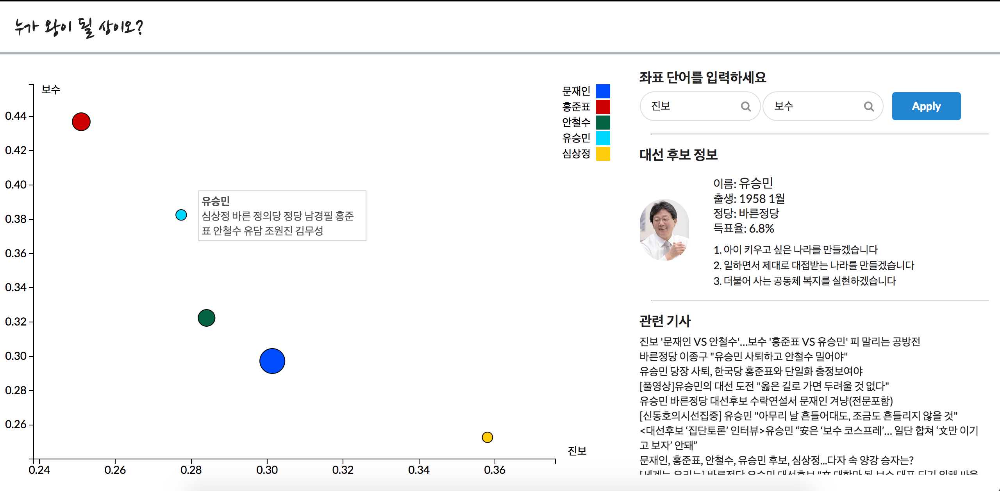

# Korean Presidential Election Visualization

19대 대통령 선거 후보들에 대해 언론 기사들을 임베딩하여 시각화한 시스템입니다.

It is visualization system that visualize Korean 19th presidential election candidates using embedding method(word2vec) with news articles.

## Dependency

* python 3.x version (Anaconda)
* Flask (Web server framework)
* Gensim (word2vec library)
* BeautifulSoup (web parsing library)
* newspaper (python web scraper library)
* Konlpy (Korean NLP library)
* Semantic UI (Web ui library, It is already in source directory )

## Run
python init.py

and you can access through 5015 port
